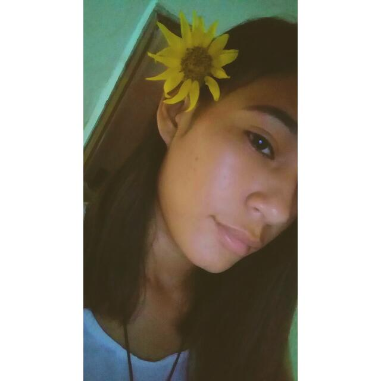

## 01 - Carro (Python)

- O que você fez
    - Fiz a questao completa.
- Com quem e como você fez
    - com amigos.
- O que aprendeu e sabe fazer
    - Aprendi a fazer a parte do menu com o slipt que eu não sabia fazer antes e usar a classe.
- O que tem dificuldade ainda
    - tenho dificuldade ainda na parte do carro andar.
- Quanto tempo levou pra fazer a atividade
    -levei mais de 1h para conseguir terminar.

## 02 - Calculadora (Python)

- O que você fez
    - Consegui concluir a questão.
- Com quem e como você fez
    -  tive ajuda do meu namorado apenas em algumas partes do codigo.
- O que aprendeu e sabe fazer
    - aprendi a fazer o codigo quase todo
- O que tem dificuldade ainda
    - tive dificuldade apenas na parte de converter no momento de imprimir.
- Quanto tempo levou pra fazer a atividade
    - levei menos de 1h para terminar.

## 04 - Pet

- O que você fez
    - Fiz a questao completa.
- Com quem e como você fez
    - com amigos e meu namorado.
- O que aprendeu e sabe fazer
    - aprendi a fazer a parte de brincar, comer e banho.
- O que tem dificuldade ainda
    - Tenho bastante dificuldade em pensar em como fazer em  java, mas isso vai melhorar aos poucos.
- Quanto tempo levou pra fazer a atividade
    - levei mais de 1h  para conseguir comcluir a atividade.

## 05 - Topique de luxo

- O que você fez
    - fiz duas versoes da questao a primeira estava incompleta e a outra que enviei esta completa.
- Com quem e como você fez
     - fiz na sala de aula com o auxilio de amigos.
- O que aprendeu e sabe fazer
    - Aprendi a remover os passageiros e a inserir passageiros.
- O que tem dificuldade ainda
    - Ainda tenho bastante dificuldade em pensar em como fazer em  java, mas isso vai melhorar aos poucos.
- Quanto tempo levou pra fazer a atividade
    - levei mais de 1h  para conseguir concluir a atividade.
    
    ## 06 - Contato

- O que você fez
    - fiz apenas o começo da questão...
- Com quem e como você fez
    - ...           
- O que aprendeu e sabe fazer
    - ....
- O que tem dificuldade ainda
    - ....
- Quanto tempo levou pra fazer a atividade
    - ....
    
    ## 07 - Agiota

- O que você fez
    - Fiz duas versões da questão, na primeira fiz a metade da questão e na segunda versão conclui a questão.
- Com quem e como você fez
    - Fiz com ajuda de amigos.
- O que aprendeu e sabe fazer
    - Consegui aprender a parte de "Transação" e "Cliente".
- O que tem dificuldade ainda
    - Ainda tenho bastante dificuldade por não ter tempo suficiente para programar, mas a maior dificuldade nesse codigo foi em cadastrar.
- Quanto tempo levou pra fazer a atividade
    - Mais de 1h.
    
  ## 09 - Empresa

- O que você fez
    - Conclui a atividade fiz todas as classes porem tive dificuldade em fazer a parte da classe empresa.
- Com quem e como você fez
    - Fiz sozinha e com auxilio do video.
- O que aprendeu e sabe fazer
    - Aprendi a usar melhor o get.
- O que tem dificuldade ainda
    - Tenho dificuldade em fazer a parte da classe empresa.
- Quanto tempo levou pra fazer a atividade
    - mais de 2hs
